# Testing Section
## A. Code Validators

### a. [HTML Validation](https://validator.w3.org/#validate_by_input)  

- [index.html](docs/html-validation-img/html-validation-index.png)
- [bio.html](docs/html-validation-img/html-validation-bio.png)
- [contact.html](docs/html-validation-img/html-validation-contact.png)
### b. CSS Validation  

- 

    

    
## A. Testing User Stories from User Experience Section

   -   ### a. Artist's Fan Visitor Goals

- **1.	As a music lover, I want to be able to see a list of songs and albums of the singer so that I can browse and play the music.**  
        - In the Home Page of the site, there is a list of songs on which the user can listen to at their discretion.  
        - The layout for these sections is very straightforward. The name of the songs to the right and the control (play) button to the right.  
        - The song name becomes bold when hovered on to add interactivity to the user while listening to the song. 

1. Go to Home page and scroll down to My Music Section  
2. Pick the song you want to listen to   
3. Click the play button    

- Desktop  
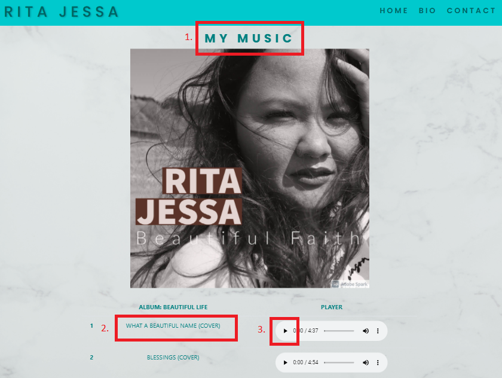  

- Mobile  
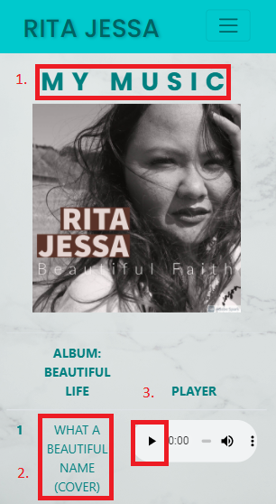    

- **2.	As an artist’s fan, I want to watch latest videos of the artists so that I can enjoy her music more.**  
        - There is a dedicated New Release Section in the Home Page wherein the artist’s latest music video is posted.  
        - The user can decide whether to view it or not by clicking the play button.  

1. Go to Home page and scroll down to My New Release Section    
3. Click the play button    

- Desktop  
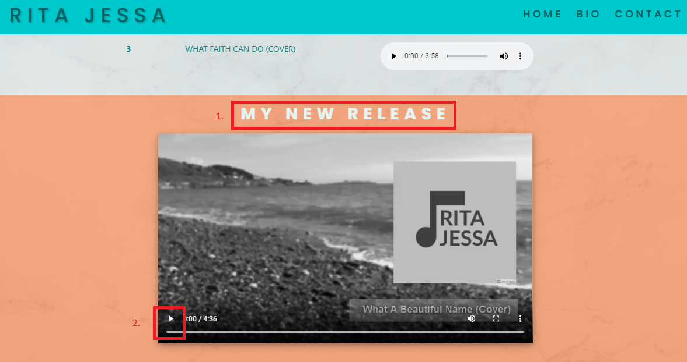  

- Mobile  
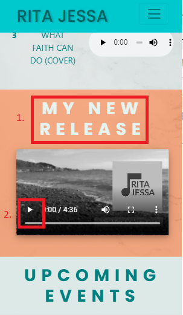    

- **3.	As an artist’s fan, I want to Know all the upcoming events where she will be performing so I can go there and support her.**   
        - The last section of the Home Page contains a table wherein the artist’s upcoming events are posted.  
        - The table’s first column shows where the event will be. The second column contains the date and the last one contains the time.  
        - And to add visual engagement and interactivity, the row of the event hovered on becomes highlighted subtly to give ensure that the user is reading the correct information of the event.   

1. Go to Home page and scroll down to Upcoming Events Section  
2. Click the event you wish to know about  
3. The Event will be highlighted upon hovering the mouse (desktop)/ after clicking it (mobile)  

- Desktop 
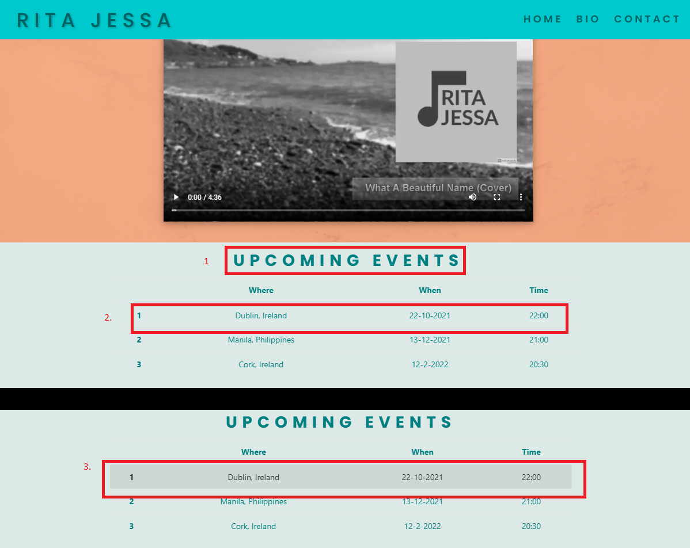  

- Mobile  
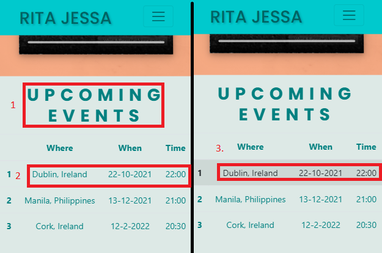   

- **4.	As an artist’s fan, I want to know about her background and history so that I will know more about her and how she became she is.**   
        - To address this story, there is a dedicated Bio Page in the website.  
        - It basically contains an Intro, Background and Music Career content.  
        - There is also quotation from a friend of hers that best describes the artist.  
        - The layout is very straight forward and the quotations is big enough so that user can immediately read it and have a general idea of who the artist is.  

1. On the Home at the top right corner of the page, click the Bio button (desktop)/  Toggler menu (hamburger icon) and click Bio on the dropdeown menu (mobile)
2. Scroll down for the Biography Section  

- Desktop  
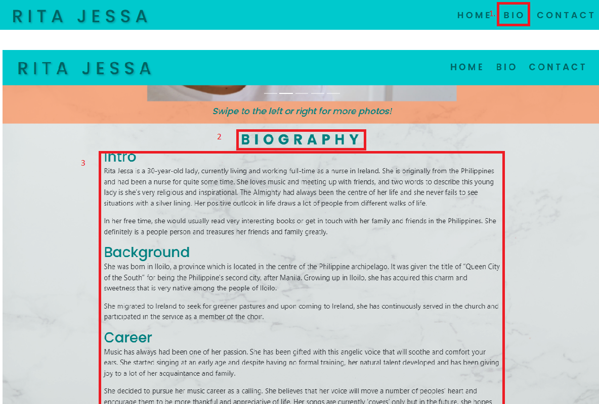   

- Mobile  
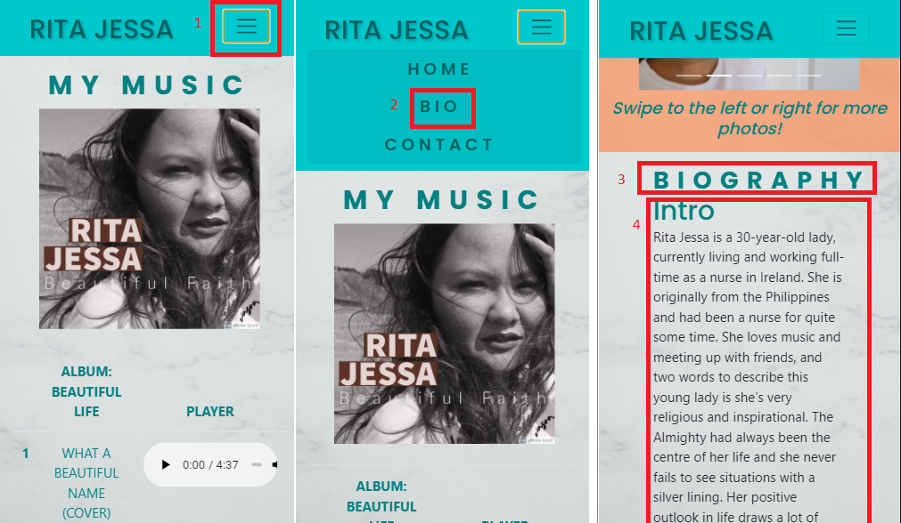   

- **5.	As an artist’s fan, I want to see different photos of the singer so that I can appreciate how she looks in a creative way.**  
        - The photo section is displayed in the Bio Page before the actual biography is.  
        - Initially, it was at the bottom half of the page but after careful consideration, I decided to place it at the top of Biography itself as it long enough that people might lose interest to read it until the end and see the photos.  
        - The photos are displayed in a carousel effect using bootstraps carousel. This effect gives a interactivity, engagement and visual interest to the user.  

1. On the Home at the top right corner of the page, click the Bio button (desktop)/  Toggler menu (hamburger icon) and click Bio on the dropdeown menu (mobile)
2. Click the arrowhead beside the picture to view the photos
3. Upon the clicking the arrowhead, you will see the next or the previous image

- Desktop  
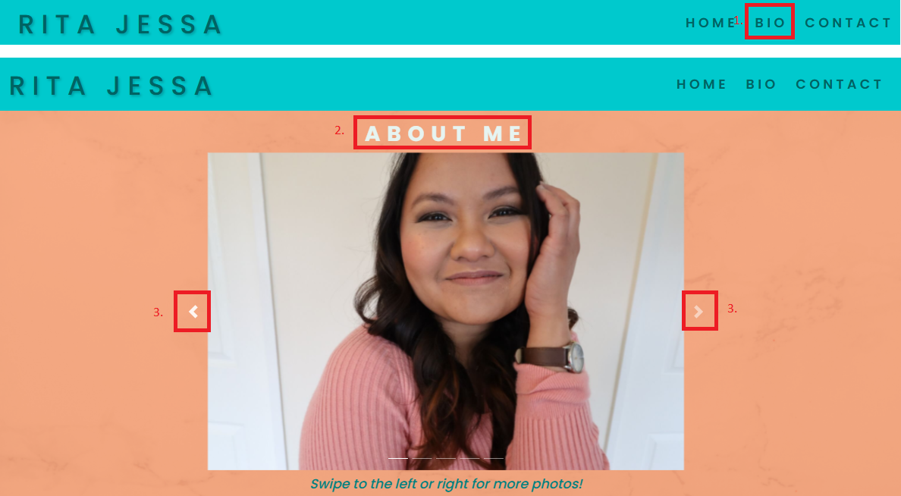   

- Mobile  
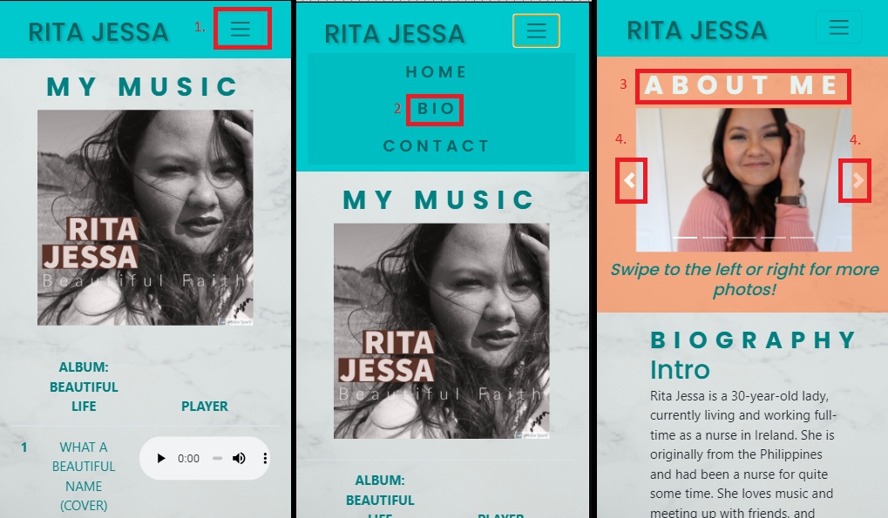   

- **6.	As an artist’s fan, I want to Be able to contact her for possible events/booking so that She can perform if I will have an event/ gathering.**  
        - The Contact Page contains a modal wherein they can send inquiries/booking.  
        - The modal contains Name, Email Address, Contact Number and Description of the Inquiry/Booking. Once the user has completely filled out the information. They can click the Send button.  
        - The Send button has a contrasting colour to the form itself to make sure the user can see it and intuitively click it after the details are filled out.  

1. On the Home at the top right corner of the page, click the Contact link (desktop)/  Toggler menu (hamburger icon) and click Contact on the dropdeown menu (mobile)
2. You will be redirected to the Contact Page.
3. On the contact page, fill in the necessary information and add your inquiry/message.
4. Once finish filling it out, click the Send Message button underneath
5. You will redirected to a feedback page that your message was successfully sent.

- Desktop  
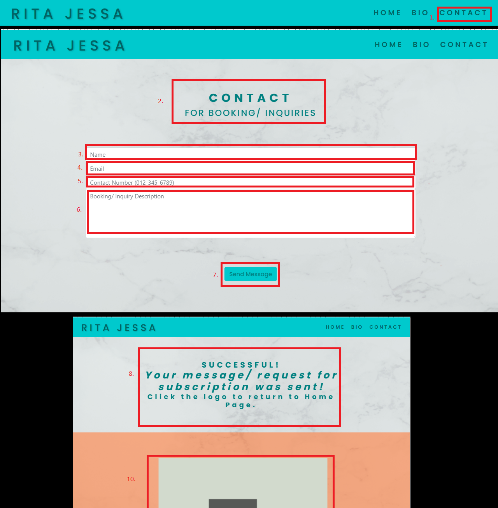   

- Mobile  
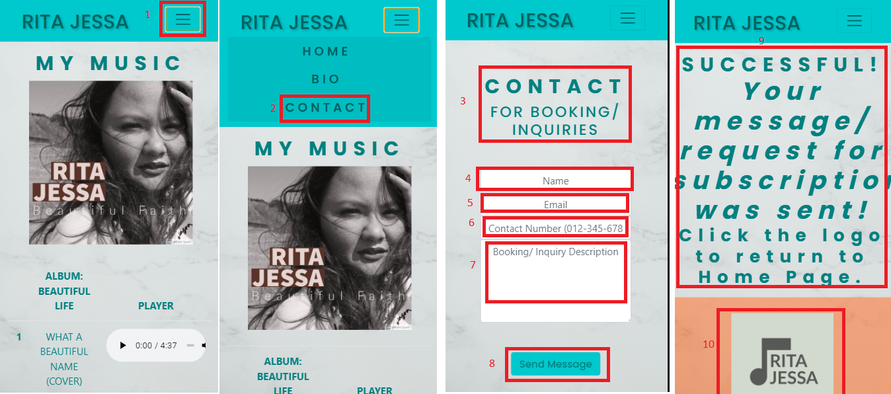   

- **7.	As an artist’s fan, I want to get notifications re: events/ new releases so that I get to be updated.**  
        - The footer section, which sits at the bottom of every page, contains a simple form on which user can fill in in their Email Address and click the Subscription button to subscribe.  
        - The Subscribe button sits next to the Email and can be easily distinguished and intuitively clicked due to a ontrasting colour to the Email input.  

1. On any page in the website, scroll down to the bottom   
2. Type in your email address and click Subscribe   
3. Upon clicking subscribe, you will be redirected to a feedback page upon successful sending of your newsletter subscription request    

- Desktop  
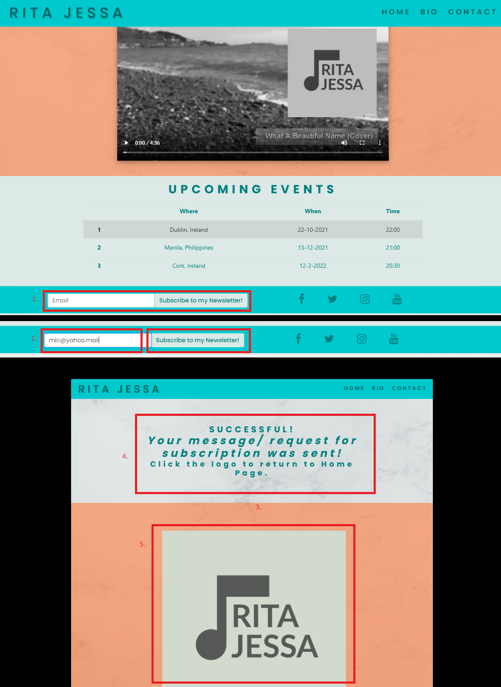   

- Mobile  
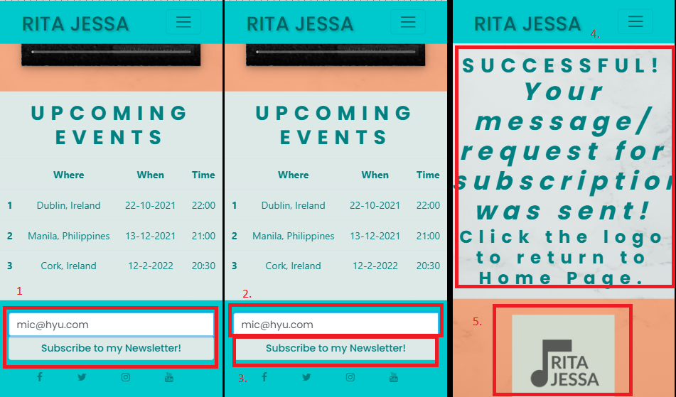  

- **8.	As an artist’s fan, I want to Know her social media links so that I get to know how many people follow them and how trustworthy they can be.**  
        - The footer section, which sits at the bottom of every page, contains icons to the artist’s social media accounts.  
        - When clicked, the icons are opened in a new tab so that users can easily go back the artist site after viewing the social media account.  

1. On any page in the website, scroll down to the bottom   
2. Icons of the artist's social media ccount links   
3. Upon clicking the icon, the social media webpage will open into a new page    

- Desktop  
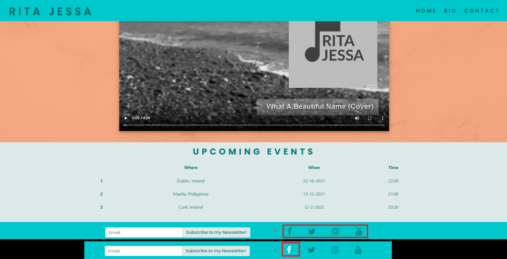   

- Mobile  
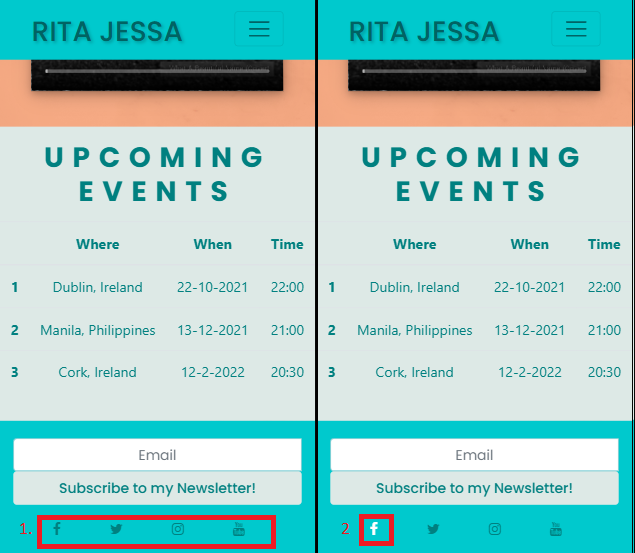  

- **9.	As an artist’s fan, I want to buy merchandise, limited memorabilia, album so that I can add it into my collection.**  
        - Currently this user story hasn’t been added to the features and content of the website. This will however be added in the future together with the other planned improvements for the site.  

    -   ### b. Potential Fan Visitor Goals  

- **1.	As potential fan, I want to a straightforward layout of the site, so that it will be very easy to navigate it.**  
        - Upon entering the site, the user will immediately be greeted with a typical site layout wherein the name of the site is displayed on the left side and the navigation links is at the right on which they can click to go to the desire page.  
        -All sections of a page are clearly separated and contains header to determine what is the content of that section.
        The footer sits at the bottom containing the social links and Subscription to Newsletter form.  

- **2.	As potential fan, I want to view her site to be simple so that I can browse it with ease.**  
        - The layout of the site was designed for the convenience of the user so it can be read from top to bottom, left to right.

- **3.	As potential fan, I want to be able to contact someone immediately if I need to so that it will save me the hassle of waiting for a long response.**  
        - There is a dedicated contact page in the site wherein an immediate contact number for the music production handling the artist is present. The user can ring the number should they have immediate concerns.   

1. On the Home at the top right corner of the page, click the Contact link (desktop)/  Toggler menu (hamburger icon) and click Contact on the dropdown menu (mobile)
2. You will be redirected to the Contact Page.
3. On the contact page, scroll down and you will see the urgent contact section.

- Desktop  
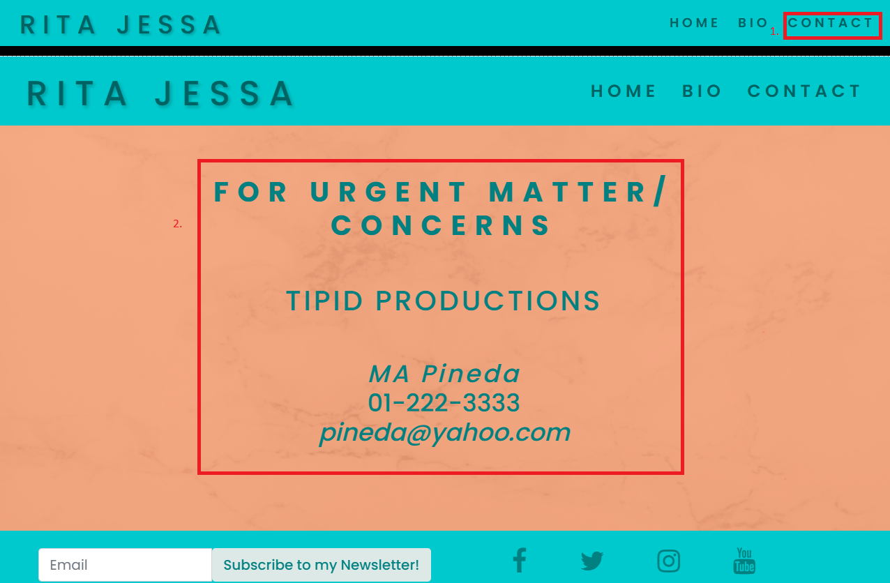   

- Mobile  
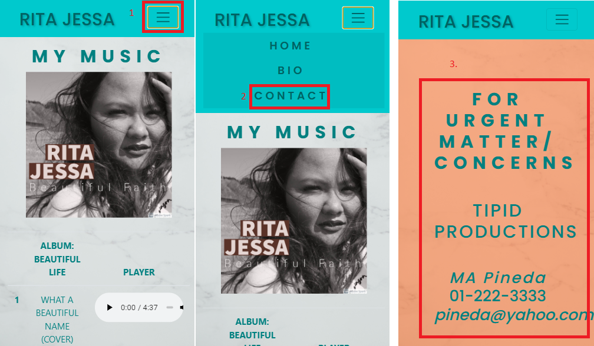   

    -   ### c. Site Owner Goals

- **1.	As the artist, I want to create a website so that I can increase my fan base, showcase my talent and establish an online presence.**  
        - The website was created containing media on which the artist’s songs and video are displayed and can be watched and listen to.  
        - It also contains a Subscription Form to a Newsletter and icons linked to her social media accounts.  

- **2.	As the artist, I want to share a short bio about me in my homepage so that people who don’t know me can immediately know the kind of singer I am.**  
        - There is a dedicated Bio Page in the website the contains the artist background and musical history.

- **3.	As the artist, I want to showcase photos one at a time so that my fans can get excited and anticipate what to see next.**  
        - The photo section which is in the Bio Page contains carousel effect on which users can view picture one at a time.  

- **4.	As the artist, I want to clients or fans to be able to contact me and my team so that I can land more gigs and events.**  
        - There is modal for Booking/ Inquiries for the artist and an immediate contact number of the music production that users can utilise if they wish tog et in touch with the artist.  

- **5.	As the artist, I want my site to inspire people so that my purpose in singing and sharing my talent will be fulfilled.**  
        - The overall layout, design and feel of the site is to give an inspirational theme. The design, colours and typography used were chosen to achieve this.  

- **6.	As the artist, I want to make my site a reflection of who I am as an artist- optimistic, reflective and spiritual so that more fans will fall in love with my music.**  
        - The overall layout, design and feel of the site is to give an inspirational theme. The design, colours and typography used were chosen to achieve this.  

- **7.	As music production company, I want to increase the number of people who will be revisiting the site so that to maintain artist’s social currency.**  
        - The layout was designed according to user stories from fans and general music lovers. It provides a simple and intuitive website that users can use with ease and confidence. By doing so, the website creator hopes to increase the traffic in the site thereby increasing the number of users revisiting the site.  

## B. Chrome dev tool  

## Lighthouse  
    
- ### Home Page  
    The issue I had upon testing the hope page was initially the Progress report was below 50%. I had to changed all the images for better loading time. After same, report was 70% only. In order to deal with this, I had to hide images using media queries and added <meta name="description" content="...">. Also, i added <width="..." height=".."> attribute to images. After doing same, report became >90%.

    -[**Desktop**](https://github.com/michaelangelopineda/milestones1-singer-ritajessa/blob/master/docs/lighthouse-testing-img/desktop-index-lighthouse.png)  
    -[**Mobile**](https://github.com/michaelangelopineda/milestones1-singer-ritajessa/blob/master/docs/lighthouse-testing-img/mobile-index-lighthouse.png)   

- ### Bio Page

    The Bio Page testing initially was below 80% for Progress. Treated same image elements similar to the Home Page multiple times and ajusted the font color of the navigation for better contrast and improves to >90% after same.

    -[**Desktop**](https://github.com/michaelangelopineda/milestones1-singer-ritajessa/blob/master/docs/lighthouse-testing-img/desktop-bio-lighthouse.png)   
    -[**Mobile**](https://github.com/michaelangelopineda/milestones1-singer-ritajessa/blob/master/docs/lighthouse-testing-img/mobile-bio-lighthouse.png)   
 
- ### Contact Page
    The contact page was treated different Added <rel="noopener"> as per recommendation of Lighthouse in the <a> links in the social media. I also added <meta name="description" content="..."> to the <head> and Progress and SEO improved to >90% 

    -[**Desktop**](https://github.com/michaelangelopineda/milestones1-singer-ritajessa/blob/master/docs/lighthouse-testing-img/desktop-contact-lighthouse.png)   
    -[**Mobile**](https://github.com/michaelangelopineda/milestones1-singer-ritajessa/blob/master/docs/lighthouse-testing-img/mobile-contact-lighthouse.png)   

## C. Fixed Bugs  

- Collapse hamburger menu for navbar is not showing on mobile view and carousel effect not working despite adding the bootstrap5 links. *Fixed*  
    - Changed the `<script>` right before the `<body>` to the older version of Bootstrap4.5.3  

- Upon adding the [background-image](docs/issues-img/bg-img-issue.png) of the page, all the elements compressed and aligned horizontally instead of vertically, thereby disrupting the flow of the content. *Fixed*  
    - It was solved by editing the css declaration for `.bg-image`  

- There was a [`gitpush error`](docs/issues-img/git-push-error-issue.png) when doing the initial part of the project. *Fixed*  
    - I had to open a new workspace in gitpod and copy-paste all initial codes. Also, all the media items were compressed to fit the recommended size allowance.  

- The width of the [audio element's size](docs/issues-img/audio-issue.png) is non-responsive. *Fixed*  
    - It was fixed by adding `width: 10em` css.  

- Boostrap5 link in the head element and Bootstrap4.5.3 in the body element. *Fixed*  
   -  Reconcile all bootstrap version in html document. Changed bootstrap link to `    <link rel="stylesheet" href="https://cdn.jsdelivr.net/npm/bootstrap@4.5.3/dist/css/bootstrap.min.css"
        integrity="sha384-TX8t27EcRE3e/ihU7zmQxVncDAy5uIKz4rEkgIXeMed4M0jlfIDPvg6uqKI2xXr2" crossorigin="anonymous">`  in the head element  

- Font color of links when opening the website is white. *Fixed*  
    - It was solved by deleting the pseudo class :link; in the navbar in css.  

- At 992px width in Chrome Dev Tool, the [background color](docs/issues-img/navbar-bg-color-issue.png) appearing in navbar is similar to the color of the navigation menu on toggle mode. *Fixed*  
    - It was fixed using media query `@media only screen and (max-width: 991.98px)`  

- White space in the Contact Page and Feedback Form Sent Page in different devices. *Fixed*
    - Adjusted padding and used media queries to target specific sections to push down the footer to the bottom of the page.  

## D. Supported Browsers

- The Website was tested on Google Chrome, Microsoft Edge and Mozilla Firefox browsers. 

## E. Testing for Supported Devices

- The websites each page was viewed and tested in Chrome Dev tool using different breakpoints emmanating the width and size of different desktop, laptop, and mobile devices. 

- The site was tested for Galaxy Notes II, Galaxy S III, Moto G4, Galaxy S5, Pixel 2, Pixel 2XL, , iPhone5/SE, iPhone6/7/8, iPhone6/7/8 Plus, iPhoneX, iPad, iPad Pro, Surface Duo and Galaxy Fold.  

- Please see attached file for the [table result](docs/supported-devices.xls).  

- A large amount of testing was done to ensure that all pages were linking correctly.

## F. Further Testing

- Friends and family members were asked to review the site and documentation to point out any bugs and/or user experience issues.